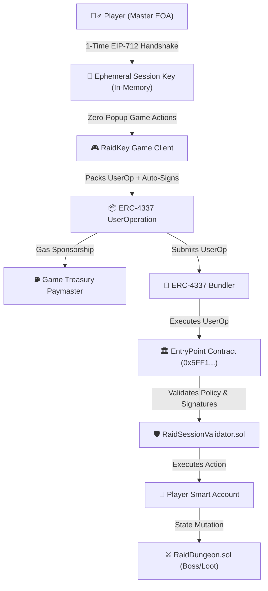

# ROAD TO DEVCON – IIITN EDITION

## RaidKey

### Built At
Ethereum Research Workshop & Builders Lab  
IIIT Nagpur × Bhaisaaab

---

### Project Overview
**RaidKey** is an Account Abstraction (ERC-4337) gaming infrastructure and live decentralized RPG raid game that completely eliminates the Web3 gaming UX friction dilemma. 

Players can play an entire real-time on-chain raid session without seeing a **single MetaMask / wallet signature popup** after starting their session. When the player logs out, the ephemeral session key is permanently incinerated in browser memory and invalidated on-chain.

---

### The Problem
1. **The Wallet Popup Nightmare**: Every single sword slash, spell cast, potion drink, and loot chest open in traditional on-chain games triggers a MetaMask popup, asking for a signature and gas fee. Real-time gameplay is impossible.
2. **The Custodial Security Trap**: Games that attempt to solve this usually take custody of the user's private key on a centralized backend server, exposing users to exchange/game hacks and stripping them of self-sovereignty.
3. **Unbounded Risk**: Traditional session keys often have broad permissions or vague spend ceilings, risking total account drain if an API key or memory is breached.

---

### The Solution
**RaidKey** leverages **ERC-4337 Smart Accounts with Scoped Ephemeral Session Key Validators**:
* **1-Time EIP-712 Handshake**: The player signs exactly **once** upon session start to authorize a freshly generated in-memory session key.
* **Strict On-Chain Scoping**:
  - **Contract Whitelist**: Can *only* call the verified `RaidDungeon.sol` contract.
  - **Selector Whitelist**: Can *only* invoke permitted game functions (`attackBoss`, `castSpell`, `openLootChest`, `drinkPotion`, `buyPotion`).
  - **Spend Ceiling**: Hard cap on maximum ETH/tokens spent during the session (e.g. max `0.05 ETH`).
  - **Hard Unix Expiry**: Inactive after a fixed duration (e.g. 30 minutes).
* **100% Sponsored Gas (ERC-4337 Paymaster)**: In-game moves are sponsored by the game treasury paymaster so players never worry about gas calculations.
* **Zero-Friction Logout & Auto-Revocation**: Logging out instantly burns the ephemeral key from memory and bumps the session nonce on-chain, rendering the key permanently useless.

---

### Why Account Abstraction?
Without Account Abstraction, an Ethereum account is an EOA (Externally Owned Account) where every single transaction requires ECDSA signature from the master private key.

**With ERC-4337 Smart Accounts:**
* Accounts are programmable smart contracts.
* Signature validation is delegated to modular validation logic (`RaidSessionValidator.sol`).
* Ephemeral sub-keys can be granted fine-grained, time-bounded, spend-capped permissions.
* Gas is abstracted away via ERC-4337 Paymasters.

---

### Key Features
* 🎮 **Interactive On-Chain Raid Dungeon**: Fight the *Infernal Wyrm Ignis*, cast elemental spells, drink potions, and roll for on-chain mythic loot.
* ⚡ **Zero-Popup "Combo Blitz" Mode**: Execute 5 lightning-fast on-chain attacks in under 2 seconds without a single interruption.
* 🛡️ **6-Point Policy Validator Engine**:
  1. Ephemeral key authorization check
  2. Target contract whitelist check
  3. Function selector whitelist check
  4. Cumulative spend ceiling enforcement
  5. Time-lock validity window (`validAfter` <= `timestamp` <= `validUntil`)
  6. Instant revocation nonce check
* ⛽ **Paymaster Gas Sponsorship**: Live breakdown showing `$0.00 Gas` paid by the user.
* 🔍 **Real-Time AA Inspector Drawer**: Live inspection of raw EIP-712 Typed Data, UserOperation JSON payload, `paymasterAndData`, and verification traces.
* 🌐 **Dual-Mode Execution**: Fast Simulator Mode (instant verification + telemetry) and Live Sepolia Testnet execution mode.

---

### ERC-4337 / Smart Account Architecture



---

### User Flow
1. **Connect & Authorize**: Player opens RaidKey and clicks **"Authorize Session"**.
2. **Review Policy Bounds**: Modal displays the target contract, spend ceiling (0.05 ETH), expiry (30 mins), and allowed selectors.
3. **Sign Handshake (1 Signature)**: Master wallet signs the EIP-712 session policy.
4. **Seamless Real-Time Gaming**: Player executes attacks, casts Fireball/Lightning spells, drinks potions, and loots chests. All moves are signed automatically by the ephemeral session key in milliseconds.
5. **Inspect Operations**: Open the **AA Inspector** to view raw UserOps, signatures, and paymaster data.
6. **Log Out & Revoke**: Click **"Log Out & Revoke Key"**. The key is cremated in memory and on-chain session nonce is bumped. Any subsequent action signed by that key will revert.

---

### Tech Stack
* **Frontend**: Next.js 14 (App Router), React 18, TypeScript, Tailwind CSS, Lucide Icons, Canvas Confetti
* **Ethereum & Account Abstraction**: Viem, EIP-712 Typed Data Signatures, ERC-4337 UserOperations, ERC-7579 modular session validation
* **Smart Contracts**: Solidity ^0.8.20 (`RaidDungeon.sol`, `RaidSessionValidator.sol`)
* **Networks**: Ethereum Sepolia, Base Sepolia, Arbitrum Sepolia, High-Speed Simulator

---

### Project Structure
```
raidkey/
├── app/
│   ├── globals.css           # Custom dark theme and battle animations
│   ├── layout.tsx            # Root layout and metadata
│   └── page.tsx              # Central game loop and AA orchestration
├── components/
│   ├── Navbar.tsx            # Header, network selector, and wallet pills
│   ├── SessionPolicyBar.tsx  # Live session HUD, expiry clock & spend meter
│   ├── SessionHandshakeModal.tsx # EIP-712 1-click permission authorizer
│   ├── RaidArena.tsx         # Boss combat arena, animations & action deck
│   ├── CombatLog.tsx         # Real-time battle event log
│   ├── UserOpFeed.tsx        # Live ERC-4337 UserOperation audit stream
│   ├── AAInspectorDrawer.tsx # Deep-dive AA visualizer and JSON inspector
│   └── RevocationModal.tsx   # Key cremation and safety confirmation modal
├── contracts/
│   ├── RaidDungeon.sol       # Boss HP, spells, loot drop RNG, potion shop
│   └── RaidSessionValidator.sol # ERC-4337 scoped session key policy engine
├── lib/
│   ├── types.ts              # TypeScript interfaces for AA & game state
│   ├── chains.ts             # Supported chains (Sepolia, Base Sepolia)
│   ├── contracts.ts          # Contract ABIs & function selector constants
│   ├── sessionManager.ts     # Ephemeral key crypto, EIP-712 signer & revocation
│   ├── userOpBuilder.ts      # Packed UserOp constructor & composite signatures
│   ├── paymaster.ts          # Gas sponsorship calculation & paymaster data
│   └── bundlerClient.ts      # UserOp submission & verification simulator
├── DEMO.md                   # 2-minute pitch & demo script
├── ARCHITECTURE.md           # Deep architectural breakdown
├── PITCH.md                  # Comprehensive presentation summary
└── package.json
```

---

### Getting Started

```bash
# Clone the repository
git clone https://github.com/your-username/raidkey.git
cd raidkey

# Install dependencies
npm install

# Configure environment
cp .env.example .env.local

# Run the development server
npm run dev
```

Open [http://localhost:3000](http://localhost:3000) in your browser.

---

### Account Abstraction Features
1. **Ephemeral In-Memory Session Keys**: Generated locally in JavaScript memory.
2. **EIP-712 Permission Scoping**: Validated on-chain by `RaidSessionValidator`.
3. **Selector Whitelisting**: Key cannot call arbitrary functions outside the game.
4. **Cumulative Spend Limits**: Protects native assets from unauthorized draining.
5. **Hard Timestamp Expiry**: Automated expiration after session length.
6. **Gas Sponsorship (Paymaster)**: Sponsoring 100% of game moves.
7. **Instant Nonce Invalidation**: Revokes key on logout.

---

### Built During
**ROAD TO DEVCON – IIITN EDITION**  
Ethereum Research Workshop & Builders Lab  
IIIT Nagpur × Bhaisaaab
